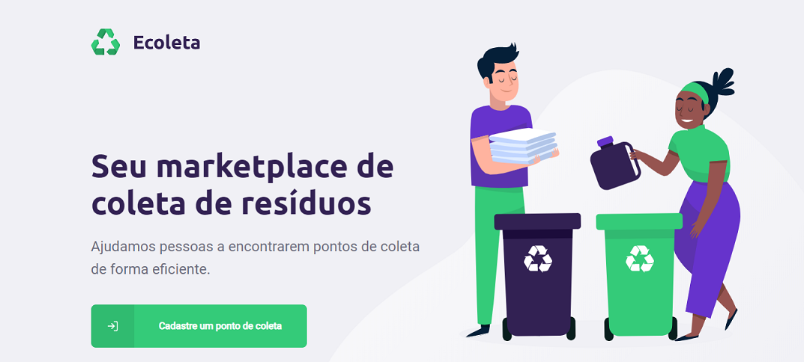

<h1 align="center"></h1>


# Ecoleta (NextLevel Week)
> Projeto de uma aplicação completa, com back-end em node, front-end em react web e mobile com react native, desenvolvida durante os dias 1 a 5 de junho de 2020.

[![NPM Version][npm-image]][npm-url]
[![Build Status][travis-image]][travis-url]
[![Downloads Stats][npm-downloads]][npm-url]

O *Ecoleta* serve como um link entre empresas que coletam residuos organicos e inorgânicos, com as pessoas que precisam descartar esses residuos. 
Consiste de uma aplicação web, onde as entidades podem cadastrar os pontos de coleta de residuos e uma aplicação mobile para os usuarios encontrarem e filtrarem pontos de coleta próximos, além de poderem entrar em contato via Whatsapp e E-mail.



## Instalação

Para instalar a aplicação na sua máquina, siga os seguintes passos: 

### Clonando o repositorio

```git init
git clone https://github.com/DanielCabral/Next-Level-Week-1.git
```
### Instalação das dependências
Abrir pasta do projeto
```
cd Next-Level-Week-1
```
Instalar dependências e executar servidor
```
cd server
npm install // ou yarn
npx dev // ou yarn dev
```

Instalar dependências e executar Front-end
```cd frontend
npm install // ou yarn
npx start // ou yarn start
```

## Exemplo de uso


## Resultados


## Historico de versões

* 0.0.1
    * Em progresso

## Meta

Daniel Cabral de Souza – [@DanielC14601541](https://twitter.com/DanielC14601541) 
Esse projeto está sob a licença MIT. Veja o arquivo [LICENSE](LICENSE.md) para mais detalhes.

[https://github.com/DanielCabral/Next-Level-Week-1](https://github.com/DanielCabral/)

## Como contribuir

1. Faça um Fork desse repositório (<https://github.com/DanielCabral/Next-Level-Week-1/fork>)
2. Crie uma branch com a sua feature: `git checkout -b my-feature`
3. Commit suas mudanças: `git commit -m 'feat: My new feature'`
4.  Push a sua branch: `git push origin my-feature`
5. Crie um novo Pull Request

